# ZoonoScope — The Zoonotic Risk Radar

This project develops a "Zoonotic Risk Radar," a data-driven framework to identify high-risk species and trade routes within the global wildlife trade network. By fusing massive datasets from international trade, virology, and genetics, I built a predictive model using Graph Neural Networks (GNNs) to forecast potential hotspots for future zoonotic disease emergence.

## Project Overview

The majority of emerging infectious diseases, including COVID-19 and Ebola, are zoonotic—originating in animals before spilling over to humans. The multi-billion-dollar global wildlife trade acts as a monstrously effective "pathogen highway," creating novel interfaces between remote ecosystems and dense human populations. However, this network is dangerously opaque. There is a lack of a systematic map to understand which trade activities, involving which species, pose the greatest threat of sparking the next pandemic.

The methodology operates at the intersection of network science, epidemiology, and deep learning, involving a multi-stage pipeline to transform raw, disparate data into actionable risk intelligence.

## Project Pipeline & Key Findings

The project is executed across a series of interconnected notebooks, each accomplishing a critical stage of the analysis.

### Building the Pathogen Sharing Network

Before analyzing trade, I first needed to understand which animals are known to share viruses. This forms the biological basis of my risk model.

*   **Data Sources:** I integrated data from ViralZone (to identify zoonotic virus families) and the VIRION database (a curated set of host-virus interactions from NCBI GenBank).

    * ViralZone Link - [Viralzone](https://www.ncbi.nlm.nih.gov/genbank/)
    * VIRION Link - [VIRION](https://viralzone.expasy.org/678)
  
*   **Methodology:**
    1.  I programmatically scraped and filtered a list of 15 key zoonotic virus families (e.g., *Coronaviridae*, *Filoviridae*).
    2.  Using the VIRION dataset, I constructed a **pathogen-sharing network graph**, where each node is a host species and an edge exists if two species are known to be infected by the same virus.
    3.  Network centrality measures (Degree, Betweenness, Eigenvector) were calculated for each host to quantify its importance in the pathogen-sharing landscape.
*   **Key Results:**
    *   A dense pathogen-sharing graph was constructed with **1,885 unique host species** (nodes) and **279,297 connections** (edges).
    *   A data-driven list of **909 high-risk host species** was generated based on a composite centrality score.
    *   Top-ranked hosts identified through this biological network included livestock and synanthropic species like **`Equus Caballus` (Horse), `Bos Taurus` (Cattle), and `Sus Scrofa` (Wild Boar)**, highlighting their central role as viral reservoirs and bridges.

**Visualizations to Include Here:**
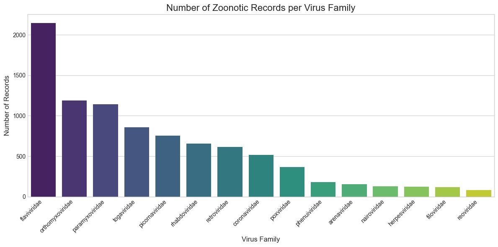
  
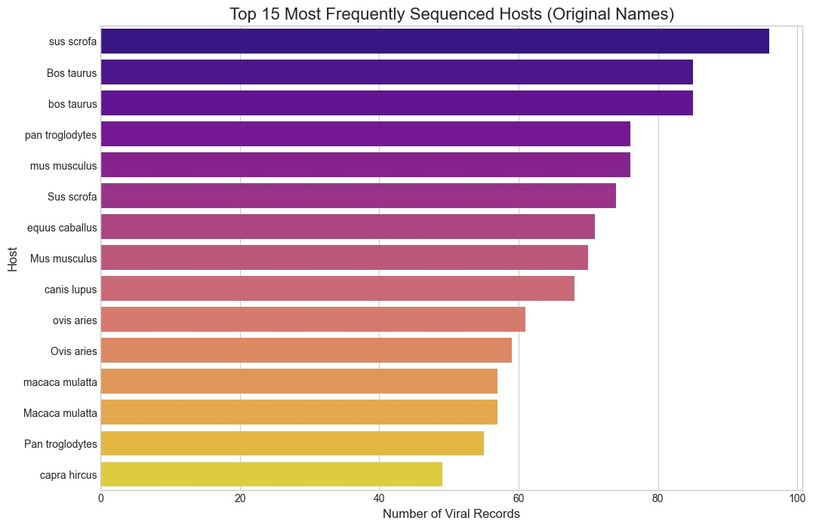

  
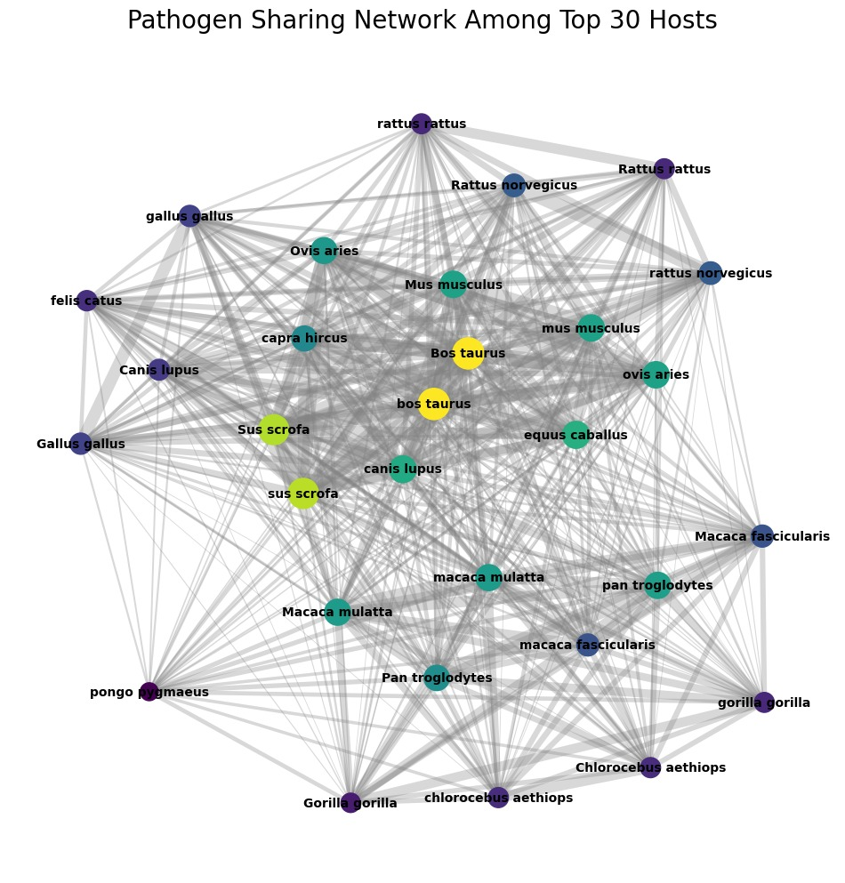

  
")

---

### Reconstructing the Global Wildlife Trade Network


With an understanding of high-risk species, I turned to mapping the "highways" they travel on. This required processing the largest available dataset on the global wildlife trade.

*   **Data Source:** The CITES (Convention on International Trade in Endangered Species) Trade Database, a massive and complex dataset.
    Link - [CITES Trade](https://trade.cites.org)
*   **Data Cleaning & EDA:**
    *   The raw data, containing **~27.9 million records** across 56 files, was loaded and concatenated.
    *   A rigorous cleaning pipeline was implemented to handle extensive missing values, filter for fauna (animal) records only, and standardize data types, resulting in a final analysis-ready dataset of **~20.1 million trade records**.
    *   Exploratory Data Analysis revealed key trends, including a peak in trade volume in the early 2000s and identifying top importing (e.g., Switzerland, Hong Kong, USA) and exporting (e.g., France, Switzerland, South Korea) countries.
*   **Methodology:**
    *   The cleaned tabular data was transformed into a **directed network graph**, where nodes are countries and weighted edges represent the total volume of trade between them.
    *   Centrality analysis was performed to identify key hubs and intermediaries in the global trade system.
*   **Key Results:**
    *   A global trade network of **256 countries** (nodes) and **8,197 trade routes** (edges) was constructed.
    *   Network analysis revealed that countries like the **United States, Switzerland, and France** are not only major traders but also critical intermediaries (high betweenness centrality), potentially acting as super-spreaders of risk.
    *   By cross-referencing with the high-risk species list from Stage 1, I identified **~1.7 million trade records** involving potentially high-risk genera.

**Visualizations to Include Here:**

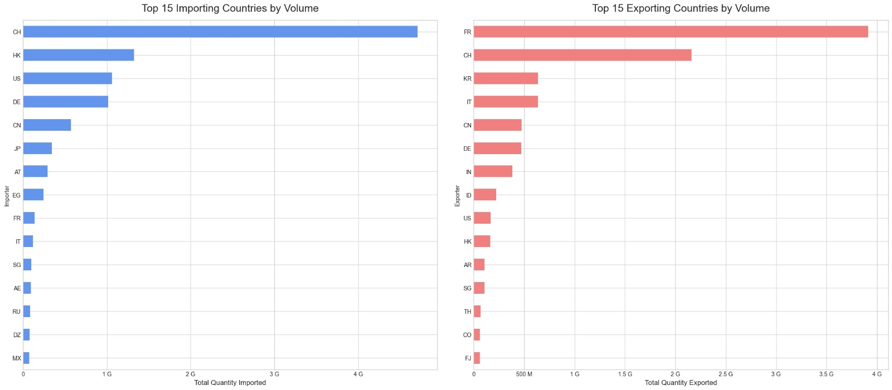")
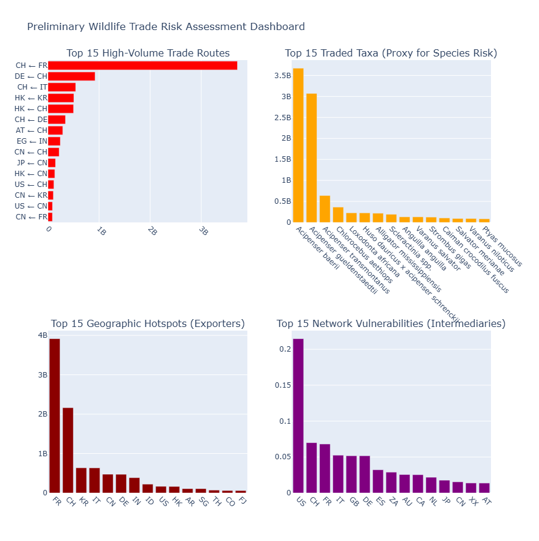


---

### Feature Engineering and Data Fusion


This stage is the conceptual core of the project: fusing the biological, genetic, and trade data into a single, coherent feature set for each species.

*   **Methodology:**
    *   **Data Integration Challenge:** A significant challenge was linking species across datasets, which use different naming conventions. I implemented a **fuzzy string matching** algorithm to map species from the CITES trade data to my pathogen network. This was difficult, achieving a direct match for **9.7%** of traded species, highlighting the sparse data landscape.
    *   **Trade Feature Engineering:** For each of the **6,153 unique species** in the CITES data, I engineered 10 features describing its trade profile (e.g., `total_quantity`, `num_importers`, `trade_diversity`).
    *   **Genetic/Pathogen Feature Engineering:** For each species found in the pathogen network, I engineered 7 features based on its network properties (e.g., `pathogen_network_degree`, `clustering_coefficient`, `is_pathogen_hub`).
    *   **Weak Supervision:** A key challenge in this domain is the lack of a ground-truth "spillover event" dataset. I created a proxy target variable using **weak supervision**. A species was labeled `high_risk (1)` if it was a major pathogen hub (top percentile in the pathogen network) or a known reservoir, and `low_risk (0)` otherwise. This resulted in an imbalanced dataset with **5.4% high-risk labels**.
*   **Key Results:**
    *   A final "master feature table" was created for **6,153 species**, containing 17 fused features from both trade and pathogen-sharing data.
    *   **Data Coverage:** I found that only **8.5%** of traded species had available pathogen-sharing data, underscoring the critical data gaps in global biosurveillance.
    *   The feature `is_pathogen_hub` was assigned to 95 species, while `is_high_risk_reservoir` was assigned to 553 species based on network topology.


---

### Predictive Modeling with Graph Neural Networks (GNN)


To predict risk, I needed a model that could learn not just from a species' individual features but also from its relationship to other, similar species.

*   **Methodology:**
    1.  **Species Similarity Graph:** I constructed a new graph where nodes are species and edges connect species with similar feature profiles (based on cosine similarity of their feature vectors). This allows the model to learn from "peers."
    2.  **Model Architecture:** A two-layer **GraphSAGE** model (a type of Graph Neural Network) was implemented using PyTorch Geometric. This architecture is ideal as it learns by aggregating information from a node's local neighborhood in the graph, effectively capturing how risk might be shared among functionally similar species.
    3.  **Training:** The model was trained on 80% of the nodes to predict the weakly supervised high-risk label.
*   **Key Results:**
    *   The GNN model achieved an impressive **Test Accuracy of 99.6%**.
    *   The classification report showed high precision and recall for both the majority (low-risk) and minority (high-risk) classes, demonstrating the model's ability to effectively handle the data imbalance and learn the complex patterns separating high-risk species.
    *   The trained model weights were saved for the final inference and explanation stage.

**Visualizations to Include Here:**

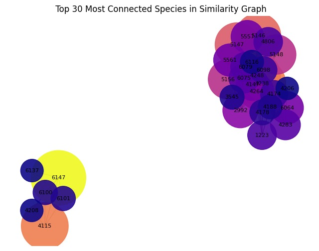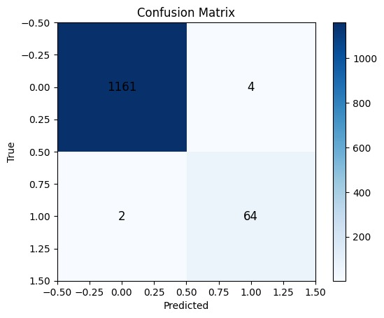


---

### Risk Scoring, Interpretation, and the "Zoonotic Risk Radar"


The final stage involved using the trained model to generate the "Zoonotic Risk Radar" and, crucially, to understand *why* the model made its predictions.

*   **Methodology:**
    1.  **Inference:** The trained GNN was used to predict a **zoonotic risk probability score (from 0.0 to 1.0)** for all 6,153 species in my dataset.
    2.  **Model Explanation:** I used **GNNExplainer**, a powerful explainability algorithm, to analyze the model's predictions. For each high-risk prediction, GNNExplainer identifies the most influential input features and neighboring nodes (i.e., the most important trade and biological connections).
*   **Final Results & Actionable Insights:**
    *   A final ranked list of species by zoonotic risk was generated. Top predicted high-risk species include **`Panthera leo` (Lion), `Panthera tigris` (Tiger), `Macaca mulatta` (Rhesus macaque), and `Ursus americanus` (American black bear)**.
    *   The risk distribution is highly skewed: **310 species (5.0%) were classified as "Critical Risk"** (probability > 0.8), representing a small but highly dangerous fraction of traded wildlife.
    *   The GNNExplainer analysis provided insights into the drivers of risk, allowing me to identify not just high-risk species but also the critical trade connections between them that are most likely to facilitate pathogen flow.

**Visualizations to Include Here:**

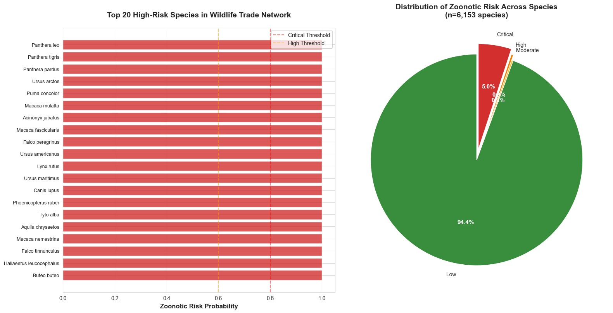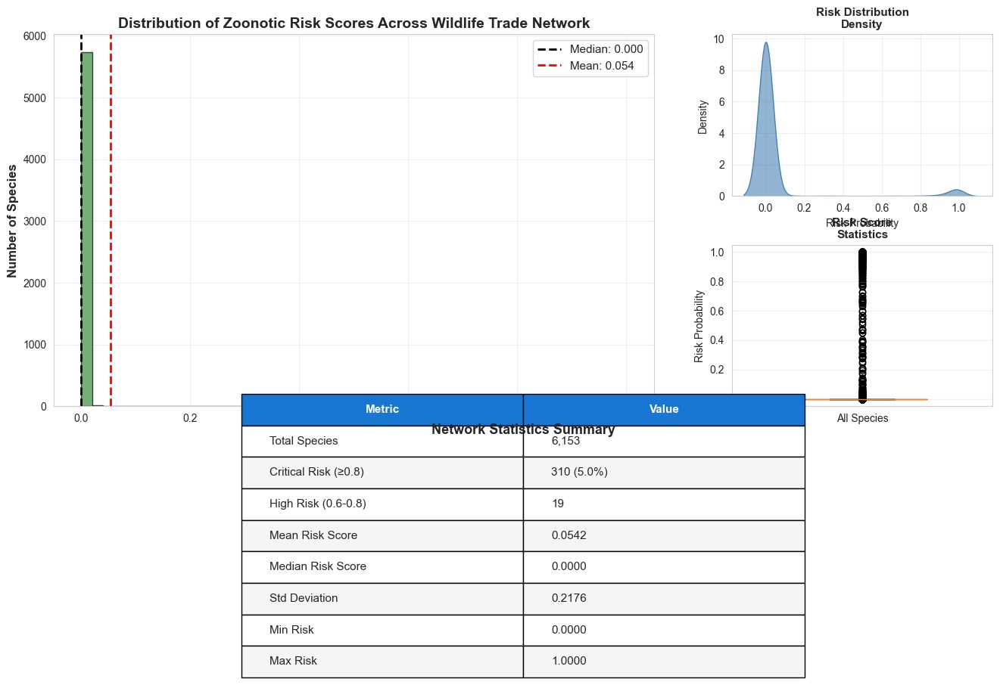
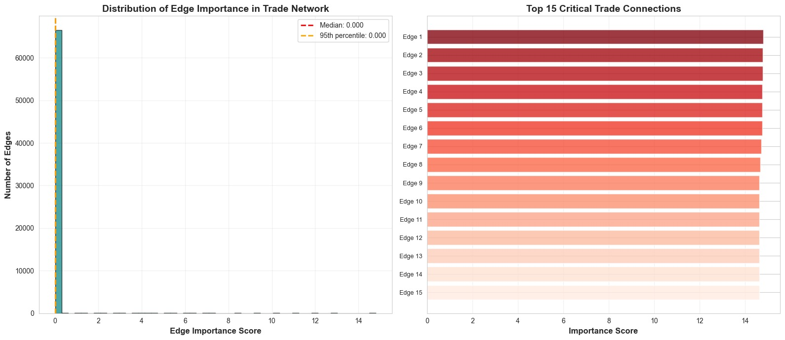


## The Zoonotic Risk Radar: An Interactive Dashboard

The culmination of this project is an interactive dashboard built with Streamlit, designed to make the model's complex outputs accessible and actionable for policymakers, epidemiologists, and conservationists.

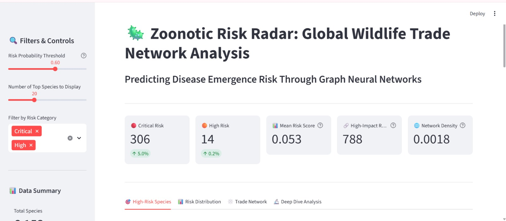

The dashboard allows users to:
*   **Explore High-Risk Species:** Interactively filter, sort, and search for species based on their predicted zoonotic risk score.
*   **Analyze Risk Drivers:** View the most important biological and trade-related features that contribute to a species' risk profile.
*   **Identify Critical Connections:** Visualize the most important edges in the trade network, representing the highest-risk pathways for potential pathogen transmission.
*   **Deep Dive Analysis:** Perform custom queries and download the underlying risk data for further investigation.

## How to Run This Project

### Dependencies
All required Python packages for this project are listed in the `requirements.txt` file. It is highly recommended to create a dedicated virtual environment to avoid conflicts with other projects.

1.  **Create a virtual environment (optional but recommended):**
    ```bash
    python -m venv .venv
    source .venv/bin/activate  # On Windows, use `.venv\Scripts\activate`
    ```

2.  **Install the required packages:**
    ```bash
    pip install -r requirements.txt
    ```

### Data Sources
Before running the analysis, you must acquire the primary trade dataset:

1.  **CITES Trade Data:** Navigate to the [CITES Trade Database website](https://trade.cites.org/). Download the complete trade records, which will be provided as a ZIP file (e.g., `Trade_database_download_v2025.1.zip`).
2.  **Placement:** Place this downloaded ZIP file in the root directory of the project. The analysis notebooks are configured to find and extract data from this file automatically.

The project is structured as a sequence of Jupyter notebooks that build upon each other. They must be run in the specified order to ensure that the necessary data artifacts are generated for subsequent steps.


### Launching the Interactive Dashboard
After running all the analysis notebooks, you can launch the Zoonotic Risk Radar dashboard.

1.  Ensure all result files (`node_risk_scores.csv`, `edge_risk_scores.csv`, etc.) are present in the root directory.
2.  Run the following command in your terminal:
    ```bash
    streamlit run dashboard.py
    ```
3.  Your web browser will automatically open a new tab with the interactive dashboard.
